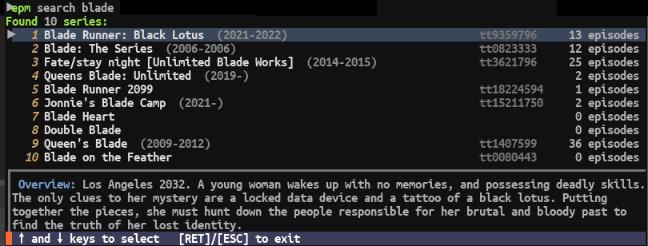

# epm

Commandline-based episode calendar/manager/scheduler/tracker (EPisode Manager)

Inspired by [Episode Calendar](https://episodecalendar.com).

## Concepts

Series that have been added to epm can have one of these user states:

- `planned`  Just added, nothing seen.
- `started`  Some episodes seen, but not all.
- `completed` All episodes seen but not archived (or explicitly restored).
- `archived`  All episodes seen and series is "ended" or "cancelled". 
- `abandoned` Archived but only partially seen.

Most of these states are implicit and automatic. 
However, the `archive` state can be manually controlled by the `archive` and `restore` commands.

How a series moves between the states is hopefully quite obvious when using the tool.

However, a few "trickier" ones exist:

- Command `mark`: If in `planned` moves to `started`. If it was the last episode (and the series is ended/cancelled), moves to `archived`.
- Command `unmark`: If in `archived` moves to `started`. If no episode marked afterwards, moves to `planned`.

## Dependencies

Requires Python 3.9, because type hints are used (the lower-case variants).

- [requests](https://pypi.org/project/requests)
- [orjson](https://pypi.org/project/orjson) (optional)
- `zstd` command-line tool. For compressing backups. (optional)
- [API key for The Movie Database](https://www.themoviedb.org)

## File locations

The configuration, series "database" and their states is stored in:

    ~/.config/epm/
	
Mainly the file `series` but also numbered backups of it.
If this is important to you, it's recommended to backup this directory.

Run-time configuration is stored in the file `config`.

## TMDb API key

Key is read from the environment:

    TMDB_API_KEY

Or set it in the configuration:

    epm config --api-key <your key>

## Examples

Note, the exact appearance of these output examples might change. 
They're continuously being tweaked and improved.

Add a series you'd like to monitor:

    ⯈epm add twin peaks 
    Found 10 series:
       #1 Twin Peaks                             1990-1991
       #2 Twin Peaks                             2017-    
       #3 Twin                                   2019-    
       #4 Georgia Coffee: Twin Peaks             1993-    
       #5 Twin Turbos                            2018-2020
       #6 Twin Hawks                             1984-1985
       #7 Twin of Brothers                       2004-    
       #8 Lexi & Lottie: Trusty Twin Detectives  2016-2017
       #9 Twin Hearts                            2003-2004
      #10 Twin My Heart                          2019-    
    Select series (1 - 10) to add --> 1    [user input]
    Series added:  (series renumbered)
       #1 Twin Peaks  1990-1991  tt0098936

Now the series is added.

All added series can be listed by using the `list` / `ls` command:

    ⯈epm ls
       #1 Twin Peaks              1990-1991  tt0098936
           Total: Unseen: 30  1d 53min
           Next: s1e01 Pilot  

Mark episodes that has been watched:

    ⯈epm mark 1 s1
    Marked 8 episodes as seen:  7h
       <list of episodes cut out>

	⯈epm mark 1 s2e1-20
    Marked 20 episodes as seen:  16h 17min
       <list of episodes cut out>

Then, show current status, using no arguments (or the `unseen` command):

    ⯈epm
       #1 Twin Peaks                                                                      1990-1991   1 unseen
           Next:   s2e22 Episode #2.22                                                        46min 1991-06-10

For a bit more "fancy" display of future episodes, use the `calendar` command:

    ⯈epm cal 2
    ┏━━━━━━━━━━━━┥ August 2022  week 31
    ┃  1st Monday
    ┃  2nd Tuesday
    ┃  3rd Wednesday
    ┃  4th Thursday
    ┃      • The Orville  s3e10 Future Unknown                                                          
    ┃      • For All Mankind  s3e09 Coming Home                                                    46min
    ┃  5th Friday
    ┃  6th Saturday
    ┃  7th Sunday
    ┃      • Westworld  s4e07 Metanoia                                                             52min
    ┠──────── week 32
    ┃  8th Monday
    ┃  9th Tuesday
    ┃ 10th Wednesday
    ┃ 11st Thursday
    ┃      • For All Mankind  s3e10 Han                                                                 
    ┃ 12nd Friday
    ┃ 13rd Saturday
    ┃ 14th Sunday
    ┃      • Westworld  s4e08 Que Será, Será                                                       59min

Sadly, these examples doesn't show that all output from epm is colorized
for clarity and emphasis.

But here's a screenshot of the menu shown by the `search` command (similar to `add`):

Basically the difference when using the `add` command is that the bottom text `... to exit` 
then says `[RET] to add  [ESC] to exit`. 

## Usage

    epm / Episode Manager / (c)2022 André Jonsson
    Version 0.9 (2022-08-01)
    Usage: epm [<command>] [<args ...>]
    
    Where <command> is:  (one-letter alias highlighted)
    search      Search for a series.
    add         Search for a series and (optionally) add it.
    delete      Completely remove a series - permanently!
    show        Show/list series
    calendar    Show episode releases by date
    unseen      Show unseen episodes of series
    mark        Mark a series, season or specific episode as seen.
    unMark      Unmark a series/season/episode - reverse of mark command.
    Archive     Archving series - hides from normal list command.
    Restore     Restore series - reverse of archive command.
    refresh     Refresh episode data of all non-archived series.
    config      Configure.
    help        Shows this help page.
    (none)  ▶  unseen
    
    See: epm <command> --help for command-specific help.
    
    Remarks:
    # = Series listing number, e.g. as listed by the list command.
    If an argument does not match a command, it will be used as argument to the default command.
    Shortest unique prefix of a command is enough, e.g. "ar"  for "archive".
    Install 'orjson' for faster load/save
    Using zstd to compress database backups.
